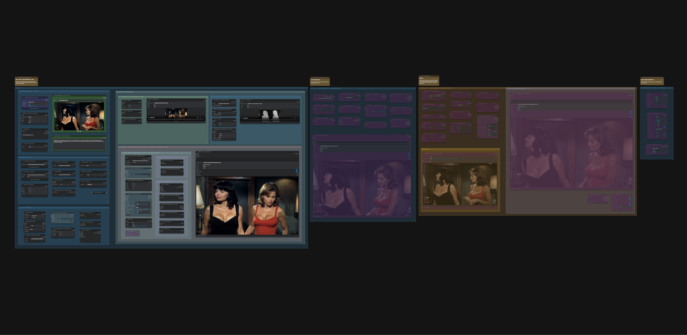
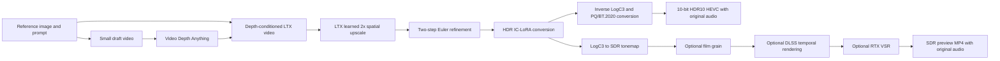

# Experimental Depth Conditioning for LTX 2.5 Distilled

The overview image predates the added HDR10 export branch. The JSON includes that branch below the HDR stage.

A ComfyUI image-to-video workflow that generates its own temporal depth guide, uses it to condition LTX 2.5 distilled, refines a learned LTX 2x spatial upscale, and applies an HDR conversion pass. It saves **10-bit HDR10 HEVC video (PQ/BT.2020)** plus a separate SDR-tonemapped preview. Optional film grain, DLSS temporal rendering, and RTX Video Super Resolution finish the SDR preview.

**Experimental, maintainer-tested workflow.** The maintainer reports repeatable successful image-to-video runs with this final graph. It combines LTX 2.5 with LTX 2.3 Union Control and HDR IC-LoRAs; this exact combination is a community workflow, not an officially validated Lightricks recipe. See the [model sources and compatibility notes](docs/MODELS.md).

## Download and setup

1. Download [the workflow JSON](workflows/LTX_2.5_Distilled_Experimental_Depth_Conditioning.json) and open or drag it into ComfyUI.
2. Install the [custom-node dependencies](docs/DEPENDENCIES.md) and the [bundled HDR10 VideoHelperSuite format](docs/HDR10.md#installation). The audited setup uses ComfyUI **0.33.1** and frontend **1.48.7**. Newer versions may work but were not part of this publication audit.
3. Download the [eight model files](docs/MODELS.md), place them in the listed folders, and select them in their loaders. Some Hugging Face downloads require sign-in and acceptance of the model's access conditions.
4. Upload your own image in **ORIGINAL REFERENCE — upload your image** (node 2). The saved reference filename is a placeholder from the author's machine; the image is not bundled. Edit the shared motion prompt.
5. Run the draft/depth stage, then enable the LTX upscale and HDR stages as described below. Keep the upstream generation nodes enabled so ComfyUI can reuse cached results between stages.

For the optional DLSS stage, install [exportAnything/ComfyUI-DLSS5-NR-Temporal](https://github.com/exportAnything/ComfyUI-DLSS5-NR-Temporal). This is the tested temporal-motion fork. Its [installation instructions](https://github.com/exportAnything/ComfyUI-DLSS5-NR-Temporal#installation--normal-users) cover the native bridge and runtime requirements.

## Pipeline

The LTX upscale consumes the clean depth-pass video latent directly. It uses the base distilled model, an anchor from the first completed depth frame, and a conservative two-step refinement before tiled decoding. HDR then uses the entire refined clip as its guide with a fresh target latent.

**HDR is the last diffusion pass.** In this final graph, optional film grain, DLSS, and RTX VSR run **after HDR tonemapping**. The learned LTX 2x upscale is a separate earlier stage; RTX VSR is an optional additional pixel upscale.

The HDR10 branch reads the raw HDR decoder output before tonemapping or SDR effects. Changing `HDRPreviewKJ` exposure/saturation or enabling those optional effects does not alter the HDR10 file. Adjust `hdr_exposure` on the HDR10 saver for its exposure. [HDR10 output details](docs/HDR10.md).

## Saved stage controls

The file deliberately opens with draft/depth generation active and later stages bypassed. This preserves the maintainer's saved setup.

| Stage | Saved state | How to use |
|---|---|---|
| Input, draft, temporal depth, depth-conditioned generation | Enabled | Supply an image and prompt, then queue. |
| `11 LTX 2x — NATIVE LATENT + EULER REFINEMENT` | Bypassed | Enable the group's nodes and queue to inspect the refined upscale. |
| `13 HDR LAST — CONDITIONED ON FINISHED UPSCALE` and `15 HDR10 OUTPUT - RAW LOGC3 TO 10-BIT PQ / BT.2020` | Bypassed | Enable the HDR processing and HDR10 saver together to generate true HDR10. Install the bundled format first. |
| `14 SDR PREVIEW OUTPUT - TONEMAPPED HDR` | Bypassed | Enable the tonemapping and preview output nodes for the separate SDR display video. |
| Film grain, DLSS, RTX VSR | Bypassed | Enable individually when desired. Their actual order is film grain → DLSS → RTX. |
| Memory helpers | Bypassed | Optional; preserve the default unless needed for your setup. |

To run the complete generation/upscale/HDR chain in one queue submission, enable the LTX upscale and HDR/output nodes before queueing. Optional finishing can remain bypassed. Enable all processing and output nodes needed by a stage; enabling only a saver will not activate bypassed upstream processing.

## Defaults in this workflow

| Setting | Value |
|---|---|
| Frames / FPS | 121 frames at 30 FPS, approximately 4.03 seconds |
| Seed | Fixed `3002545213` |
| Resolution selector | 16:9, 1 megapixel target, dimensions rounded to multiples of 64 |
| Draft → depth-conditioned video → LTX upscale | 672x384 → 1344x768 → 2688x1536 |
| Draft sampling | Euler, CFG 1, 8-step distilled schedule |
| Depth-conditioned sampling | Euler, CFG 1, **beta scheduler, 10 steps, denoise 0.8** |
| Depth guide | Strength 0.8, frame index 1, Union Control LoRA strength 1.0 |
| LTX refinement | Euler, CFG 1, sigmas `0.725, 0.421875, 0.0` |
| HDR | Euler ancestral, CFG 1, full 8-step schedule, HDR LoRA strength 1.0 |
| Upscale/HDR VAE decoding | Spatial tile 768, overlap 128; temporal size 128, overlap 16 |
| HDR preview | LogC3 input, exposure -0.29, saturation 0.86 |
| Optional DLSS | Natural, intensity 0.95, temporal sequence, motion guidance enabled |
| Optional RTX VSR | Additional 1.25x upscale, MEDIUM quality |
| Upscale/SDR preview encoding | NVENC AV1 MP4, yuv420p, 40 Mbps, original depth-pass audio |
| HDR10 video encoding | HEVC Main10 MP4, yuv420p10le, PQ/BT.2020, CRF 18, original depth-pass audio |
| HDR10 luminance target | Reference white 203 nits, ceiling 1000 nits, HDR exposure 0 stops |

The depth-conditioned pass uses the saved 10-step beta schedule; the 8-step schedule belongs to the draft and HDR passes. Sampling and bypass settings have not been changed for this release.

## Outputs and limitations

- The pre-HDR upscale saves under `output/selfdepth/LTX25/repaired_before_HDR/01_LTX2x*`.
- The SDR display preview saves under `output/selfdepth/LTX25/repaired_before_HDR/02_HDR_preview*`.
- The true HDR10 file saves under `output/selfdepth/LTX25/HDR10/03_HDR10_1000nit*`.
- HDR10 uses the bundled format to convert raw LogC3 through linear Rec.709 into PQ/BT.2020. It preserves highlights above reference white and encodes at 10 bits. The separate `HDRPreviewKJ` branch produces SDR for ordinary displays.
- This is a 1000-nit output target with hard per-channel highlight clipping. Mastering metadata describes that target; content-light measurements are left unspecified. It is not a substitute for a professional HDR grade.
- Learned refinement and HDR are generative and can change detail, motion, or appearance. The source file retains the conservative refinement settings used by the maintainer.
- Higher resolution, longer clips, and the HDR pass increase memory requirements. The reference machine uses an NVIDIA RTX PRO 4500 Blackwell with 32 GB VRAM; this is a reference configuration, not a measured minimum requirement.
- The SDR AV1 encoder requires compatible NVIDIA hardware and FFmpeg support. HDR10 uses CPU `libx265` and requires FFmpeg's `zscale` filter; it does not require NVENC. See [HDR10 installation and verification](docs/HDR10.md).

## Publication notes

This repository contains the workflow, HDR10 encoder preset, and documentation. Download model weights from their original sources; model weights, input images, generated videos, and third-party runtime binaries are not bundled.

The original generation settings and bypass states are preserved. The HDR10 update adds one saver, one instruction note, and three connections from the existing HDR decoder, audio, and FPS outputs. The current workflow has 87 nodes and 145 links. See [the dependency and publication audit](docs/PUBLICATION_NOTES.md).
